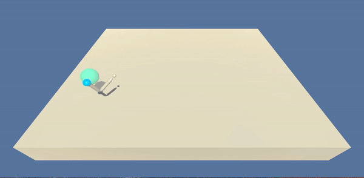

# Deep Reinforcement Learning - Continuous Control


## Project Details

The aim of this project is to train an agent to manipulate a double-jointed arm so that it can move to target locations. A reward of +0.1 is provided for each step that the agent's hand is in the goal location. Thus, the goal of the agent is to maintain its position at the target location for as many time steps as possible. The task is episodic (fixed number of timesteps), and in order to solve the environment, the agent must get an average score of +30 over 100 consecutive episodes.


#### State 

The observation space consists of 33 variables corresponding to position, rotation, velocity, and angular velocities of the arm.. Given this information, the agent has to learn how to best move the arm when performing an action. 


#### Actions

Each action is a vector with four numbers, corresponding to torque applicable to two joints. Every entry in the action vector should be a number between -1 and 1.


#### Rewards

A reward of +0.1 is provided for each step that the agent's hand is in the goal location. Thus, the goal of the agent is to maintain the edge of the robotic arm within the target location for as long as possible within a given time frame.


#### Expected Behaviour




## Getting Started


#### Step 1: Clone the Repository

You will need a python 3.6 environment set up. To be able to train and run the agents, you will need the install the dependencies. Do do so, clone the repostory and install the required packages. With the following commands you will install PyTorch, the ML-Agents toolkit, and a few more Python packages required.

```bash
git clone https://github.com/n-lamprou/DeepReinforcementLearning.git
cd DeepReinforcementLearning/python
pip install .
```


#### Step 2: Download the Unity Environment

The repository already has the Mac OSX the Reacher environment built and placed in the directory `p2_continuous-control`. To run on Linux or Windows you can download the built environment following the links that matches your operating system:

* Linux: [here](https://s3-us-west-1.amazonaws.com/udacity-drlnd/P2/Reacher/one_agent/Reacher_Linux.zip)
* Windows: [here](https://s3-us-west-1.amazonaws.com/udacity-drlnd/P2/Reacher/one_agent/Reacher_Windows_x86_64.zip)

Replace the `Reacher` executable in the `ContinuousControl/` folder of the repository with the corresponding unzipped file of your choice.


## Instructions

Once your environment is set up, navigate to the `ContinuousControl/` folder and follow the instructions beneath to train an agent or to run a simulation. 

#### Training an Agent

To train an agent run the `learn.py` script. By default this trains a DDPG agent with OU noise for action space exploration (see report for more details). You can choose whether you want the agent to train without additional noise. For example to train an agent without noise run the following command:

```bash
python learn.py -OUnoise False 
```

For more information on the options available run

```bash
python learn.py -h
```

#### Running a simulation

To run a simulation with you agent of choice run the following command:

```bash
python run.py 
```

This will open a window showing your agent manipulating the arm in the Reacher environment. A pre-trained agent is included in the repo.
