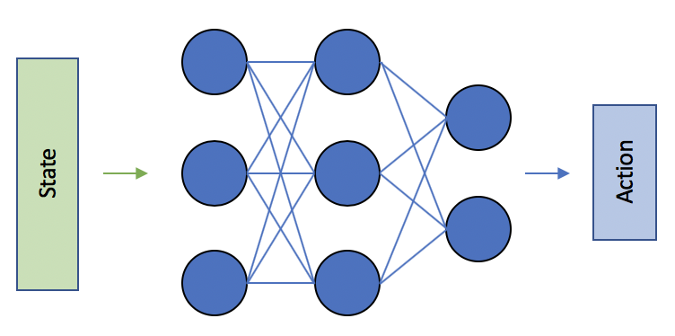
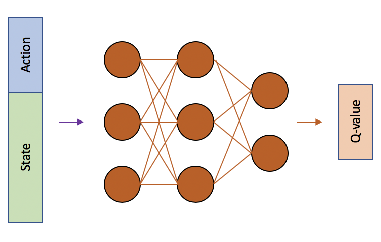
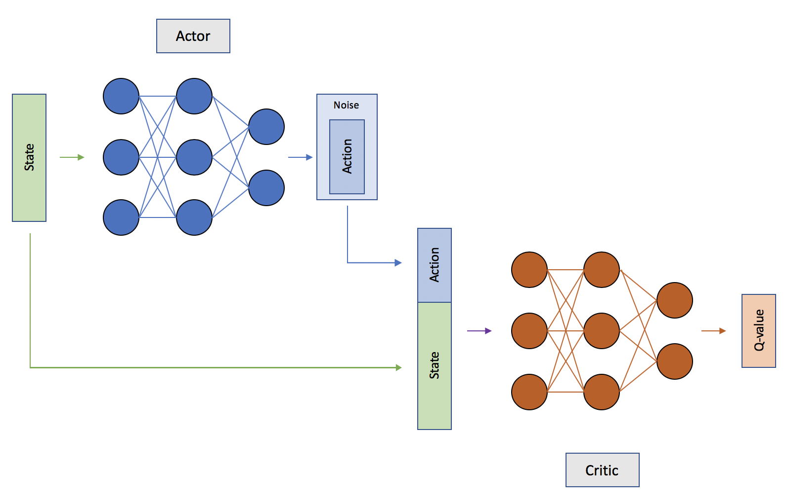
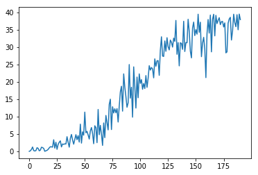

# Continuous Control - Report

The aim of this project is to train an agent to manipulate a double-jointed robotic arm so that it can move to target locations. A reward of +0.1 is provided for each step that the agent's hand is in the goal location. Thus, the goal of the agent is to maintain its position at the target location for as many time steps as possible. The task is episodic (fixed number of timesteps), and in order to solve the environment, the agent must get an average score of +30 over 100 consecutive episodes.

## Learning Algorithms

The algorithm of choice to solve the environment was Deep Deterministic Policy Gradients (DDPG, Lillicrap et al. (2015)).
DDPG is an off-policy actor-critic algorithm, applicable to continuous action spaces. 

### Overview of learning algorithms and network architecture

Below is a short summary of the components and neural network architectures used as part of the DDPG algorithm and what the learning process is.

#### Actor Network 

The Actor takes the State as input and outputs the what the agent believes to be the best action (here a set of continues values of the torque for each joint) to maximise long term reward.

**Architecture**: 3 hidden layers were used (300, 500, 200 nodes respectively) with ReLU activation. The output layer had a *tanh* activation to ensure the action vector values were between -1 and 1.

Two separate networks with identical architectures of the Actor are instansiated; one local and one target. The target network's weights are updated less often than the local network. Without fixed targets, we would encounter a harmful form of correlation, whereby we shift the parameters of the network based on a constantly moving target.

#### Critic Network

The Critic network accepts the State and the Action vectors as input and estimates of the q-value (estimated discounted future reward)

**Architecture**: 3 hidden layers were used (300, 500, 200 nodes respectively) with ReLU activation. The output layer had a linear activation.

For the reasons stated above, two separate networks with identical architectures of the Critic are instanciated (local and target).

#### Experience Replay

When the agent interacts with the environment, the sequence of experience tuples can be highly correlated. The naive learning algorithm that learns from each of these experience tuples in sequential order runs the risk of getting swayed by the effects of this correlation. By instead keeping track of a replay buffer and using experience replay to sample from the buffer at random, we can prevent action values from oscillating or diverging catastrophically.

#### OU Noise

In this implememntation the DDPG algorithm uses an Ornstein-Uhlenbeck process (correlated stochastic process) to add noise. The exploration is realized through action space noise only. Note that training without noise was also found to have good performance, possibly due to the well defined reward function.

#### Learning Process - DDPG algorithm

Initially the local and target Actor and Critic networks are instanciated with random weights. A series of actions are performed by passing the state of the environment through the local Actor network to select the action and optionally noise can be added to that action for exploration purposes. Tuples of the form (state, action, reward, next_state) are stored to the experience replay buffer.

Once the experience replay is large enough the learning process can begin. A minibatch is randomly sampled from the experience buffer and used in the follwoing learning steps to update the networks as follows.

The learning process can be broken into 3 steps:

* Update of the local Critic network
* Update of the local Actor network
* Update of both Actor and Critic target networks 

**Updating the Critic**

Similar to Deep-Q Networks (DQN), the Critic estimates the Q-value function using off-policy data and the recursive Bellman equation:

where  is the Actor or policy. 

The local Critic network is used to estimate the q-value of the current action taken given the current state:

The target is defined as:

The loss of the Critic network is defined as the mean square error between the prediction and target across the minibatch. The loss is then used to update the Critic network.

**Updating the Actor**

The Actor is trained to maximize the Critic’s estimated Q-values. The local Actor network is used to generate an action vector given a state which in turn is passed through the Critic network to estimate the q-value of the action. The loss is hence defined as:

The loss is then used to update the Actor network.

**Updating target networks**

After every learning step, perform a soft update of the Critic and Actor target networks' weights from the corresponding local networks.

where  is a small value

### Chosen Hyperparameters

The following hyperparameters were chosen following a trial and error approach. Key to the stability of learning was the low learning rate, larger batch size and the number of steps between updates. In addition, small replay buffer sizes lead to a collapse of the performance after some episodes.

* Replay buffer size: 300000
* Minibatch size for training: 256
* Discount factor: 0.99
* Interpolation parameter for soft update of target parameters: 0.0009
* Optimizer: Adam
* Learning rate (Actor): 0.00009
* Learning rate (Critic): 0.0005
* Steps between netwok update: 2 updates every 4 timesteps

## Plot of Rewards

The following plots of the rewards per episode illustrate that the agent is able to receive an average reward (over 100 episodes) of at least +30. Here 91 episodes were needed to solve the environment.

<table style="width:500%" border=1>
  <tr>
    <th align=center>Agent: DDPG, Solved in: 91 episodes</th>
  </tr>
  <tr>
    <td align=center></td>
  </tr>
</table>

## Ideas for Future Work

One key improvement to make would be to use a prioritised replay buffer. It has been shown that experience replay allows online reinforcement learning agents to reuse experiences that are not sequencial and from different times. The algorithm used here uniformly samples experience transitions from a replay memory. Although this approach is effective, it only replays transitions at the same frequency that they were originally experienced, regardless of their significance. As shown in this [paper](https://arxiv.org/abs/1511.05952 "arXiv:1511.05952") prioritising experience, so as to replay important transitions more frequently, leads to more efficient learning. 

Another improvement would be to use a distributed version of the DDPG algorithm [D4PG](https://arxiv.org/pdf/1804.08617.pdf") and train on an environment with multiple agents running simultaneously. The above paper shows that combination of the above modifications achieves state of the art performance in continuous control problems.

