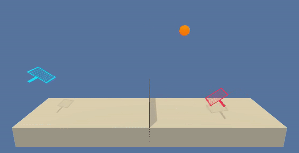

# Deep Reinforcement Learning - Collaboration and Competition


## Project Details

The aim of this project is to train two agents, each in control of a tennis racket, to collaborate in maintaining a ball in the air for as long as possible whilst bouncing it over a net. An agent is rewarded when it manages to hit the ball over the net and penalised if it drop the ball or knocks it out of bounds. 

The task is episodic (fixed number of timesteps), and in order to solve the environment, the agents must get an average score of +0.5 over 100 consecutive episodes after taking the maximum over both agents.


#### State 

The observation space for each agent consists of 3 stacked vectors of 8 variables corresponding to the position and velocity of the ball and racket making a total of 24 input varibales. It is important to note that each agent receives its own, local observation.  


#### Actions

Two continuous actions are available, corresponding to movement toward (or away from) the net, and jumping. Every entry in the action vector should be a number between -1 and 1.


#### Rewards

If an agent hits the ball over the net, it receives a reward of +0.1. If an agent lets a ball hit the ground or hits the ball out of bounds, it receives a reward of -0.01.  Thus, the goal of each agent is to keep the ball in play.


#### Expected Behaviour




## Getting Started


#### Step 1: Clone the Repository

You will need a python 3.6 environment set up. To be able to train and run the agents, you will need the install the dependencies. Do do so, clone the repostory and install the required packages. With the following commands you will install PyTorch, the ML-Agents toolkit, and a few more Python packages required.

```bash
git clone https://github.com/n-lamprou/DeepReinforcementLearning.git
cd DeepReinforcementLearning/python
pip install .
```


#### Step 2: Download the Unity Environment

The repository already has the Mac OSX the Tennis environment built and placed in the directory `p3_collab-compet`. To run on Linux or Windows you can download the built environment following the links that matches your operating system:

* Linux: [here](https://s3-us-west-1.amazonaws.com/udacity-drlnd/P3/Tennis/Tennis_Linux.zip)
* Windows: [here](https://s3-us-west-1.amazonaws.com/udacity-drlnd/P3/Tennis/Tennis_Windows_x86_64.zip)


Replace the `Tennis` executable in the `p3_collab-compet/` folder of the repository with the corresponding unzipped file of your choice.


## Instructions

Once your environment is set up, navigate to the `p3_collab-compet` and follow the instructions beneath to train an agent or to run a simulation. 

#### Training an Agent

To train set of agents (players 1 and 2) run the `learn.py` script. By default this trains a two DDPG agents with OU noise for action space exploration (see report for more details). 

```bash
python learn.py 
```

#### Running a simulation

To run a simulation with you agent of choice run the following command:

```bash
python run.py 
```

This will open a window showing your two trained agents controlling each of the rackets in the Tennis environment. A set of pre-trained agents are included in the repo.


