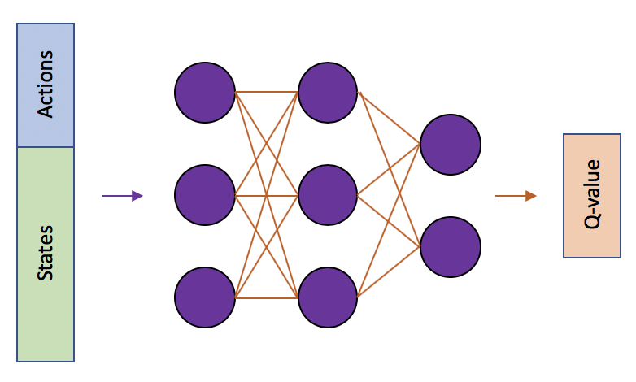

# Collaboration and Competition - Report

The aim of this project is to jointly train a set of tennis playing agents to collaborate in maintaining a rally for as long as possible. At every timestep, each agent receives its own, local, observation of the environment performs an action and receives its corresponding reward. Specifically, if an agent hits the ball over the net, it receives a reward of +0.1. If an agent lets a ball hit the ground or hits the ball out of bounds, it receives a reward of -0.01. This reward structure makes the agents' goal to keep the ball in play.

## Learning Algorithm

The algorithm of choice to solve the environment was Multi Agent Deep Deterministic Policy Gradients ([MADDPG](https://arxiv.org/pdf/1706.02275.pdf)). MADDPG adopts a framework of centralized training with decentralized execution. The policies are allowed to use extra information during training, so long as this information is not used at execution time.

The MADDPG algorithm extends the actor-critic policy gradients methods from [DDPG](https://arxiv.org/pdf/1509.02971.pdf) where essentially each agent implements a modified DDPG algorithm. The actor only uses information available to each given agent but the critic is augmented with extra information about the observations and actions of other agents. 

### Overview of learning algorithm and network architectures

Below is a short summary of the components and neural network architectures used as part of the MADDPG algorithm and what the learning process is.  

#### Actor Network 

The Actor takes the State as input and outputs the what the agent believes to be the best action (here a set of continues values of the torque for each joint) to maximise long term reward.

**Architecture**: 3 hidden layers were used (100, 200, 100 nodes respectively) with ReLU activation. The output layer had a *tanh* activation to ensure the action vector values were between -1 and 1.

Two separate networks with identical architectures of the Actor are instansiated; one local and one target. The target network's weights are updated less often than the local network. Without fixed targets, we would encounter a harmful form of correlation, whereby we shift the parameters of the network based on a constantly moving target.

#### Critic Network

The Critic network accepts the State and the Action vectors from all agents as input and estimates the q-value (estimated discounted future reward) for that agent.

**Architecture**: 3 hidden layers were used (100, 200, 100 nodes respectively) with ReLU activation. The output layer had a linear activation.

For the reasons stated above, two separate networks with identical architectures of the Critic are instanciated (local and target).

#### Experience Replay

When the agents interact with the environment, the sequence of experience tuples can be highly correlated. The naive learning algorithm that learns from each of these experience tuples in sequential order runs the risk of getting swayed by the effects of this correlation. By instead keeping track of a replay buffer and using experience replay to sample from the buffer at random, we can prevent action values from oscillating or diverging catastrophically.

#### OU Noise

In this implememntation the MADDPG algorithm uses an Ornstein-Uhlenbeck process (correlated stochastic process) to add noise. The exploration is realized through action space noise only. 

#### Learning Process - MADDPG algorithm

Initially the local and target Actor and Critic networks for each agent are instanciated with random weights. A series of actions are performed by passing the state of the environment as observed by each agent through the local Actor network to select the action and optionally noise can be added to that action for exploration purposes. Tuples of the form (state, action, reward, next_state) are stored to the experience replay buffer.

Once the experience replay is large enough the learning process can begin. A minibatch is randomly sampled from the experience buffer and used in the follwoing learning steps to update the networks as follows.

The learning process can be broken into 3 steps:

* Update of the local Critic network of each agent
* Update of the local Actor network of each agent
* Update of both Actor and Critic target networks 

**Updating the Critic**

Similar to Deep-Q Networks (DQN), the Critic estimates the Q-value function using off-policy data and the recursive Bellman equation:

where  is the Actor or policy. 

The local Critic network is used to estimate the q-value of the current actions taken by all agents given the current states of all agents:

The target is defined as:

The loss of the Critic network is defined as the mean square error between the prediction and target across the minibatch. The loss is then used to update the Critic network.

**Updating the Actor**

The Actor is trained to maximize the Critic’s estimated Q-values. The local Actor network is used to generate an action vector given a state which in turn is passed through the Critic network to estimate the q-value of the action. Policies of other agents are assumed to be known here. The loss is hence defined as:

The loss is then used to update the Actor network.

**Updating target networks**

After every learning step, perform a soft update of the Critic and Actor target networks' weights from the corresponding local networks.

where  is a small value

### Chosen Hyperparameters

The following hyperparameters were chosen following a trial and error approach. Key to the stability of learning was the low learning rate and the number of steps between updates. 

* Replay buffer size: 100000
* Minibatch size for training: 128
* Discount factor: 0.99
* Interpolation parameter for soft update of target parameters: 0.001
* Optimizer: Adam
* Learning rate (Actor): 0.00009
* Learning rate (Critic): 0.0005
* Steps between netwok update: 1 updates every 2 timesteps

## Plot of Rewards

The following plots of the rewards per episode illustrate that the agent is able to receive an average reward (over 100 episodes) of at least +0.5. Here 2381 episodes were needed to solve the environment. A maximum reward of +1.76 over 100 episodes was achieved after 2580 episides.

<table style="width:500%" border=1>
  <tr>
    <th align=center>Agent: MADDPG, Solved in: 2381 episodes</th>
  </tr>
  <tr>
    <td align=center></td>
  </tr>
</table>

## Ideas for Future Work

A common problem in multi-agent reinforcement learning is the environment non-stationarity due to the agents’ changing policies. Agents can derive a strong policy by overfitting to the behavior of other agents they are collaborating or competing with. Such policies are undesirable as they are brittle and may fail when the collaborators/competitors modify their strategies.

A potential way to minimise such effects would be to train a collection of different sub-policies. At each episode, a random sub-policy would be selected for each agent to execute and the agent policy is considered to be the ensemble of sub-policies. For each agent therefore the goal is to maximizing the ensemble objective.

