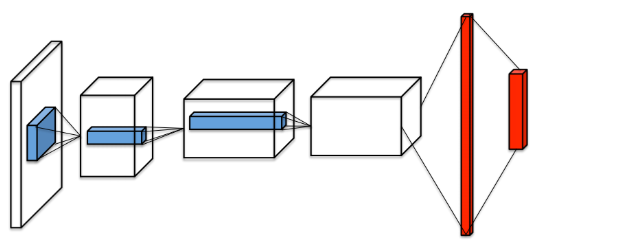
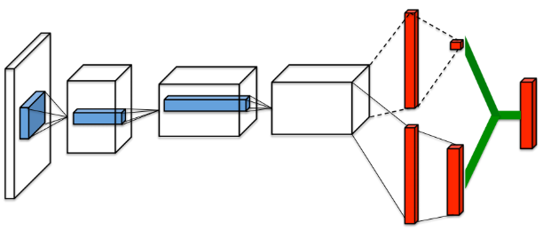
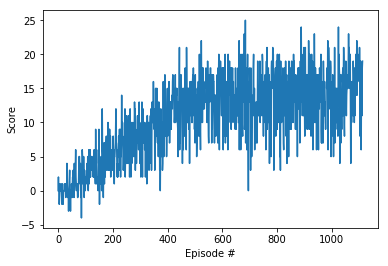
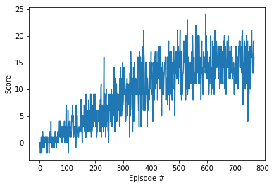
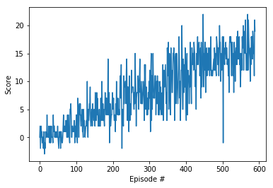
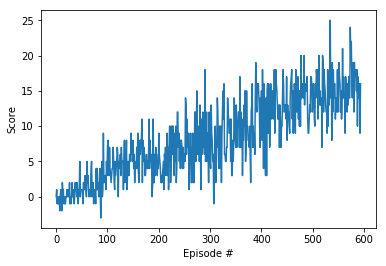

# Navigation Project - Report

The aim of this project is to train an agent to navigate and collect yellow bananas in a large, square world. The task is episodic, and in order to solve the environment, the agent must get an average score of +15 over 100 consecutive episodes.

## Learning Algorithms

Four different variations of the deep Q-learning algorithm are used to solve this environment. 

### Overview of learning algorithms and network architecture

Below is a short summary of the four learning algorithm used to train agents that solve the environment.

#### Deep Q-learning (DQN) 

The Deep Q-Learning algorithm represents the optimal action-value function as a neural network instead of a table. The DQN takes the state as input and returns the predicted action values for each possible action.

A naive form of the reinforcement learning algorithm with neural networks is unstable and so this version of the algorithm addresses these instabilities by using two key features:

*Experience Replay*

When the agent interacts with the environment, the sequence of experience tuples can be highly correlated. The naive Q-learning algorithm that learns from each of these experience tuples in sequential order runs the risk of getting swayed by the effects of this correlation. By instead keeping track of a replay buffer and using experience replay to sample from the buffer at random, we can prevent action values from oscillating or diverging catastrophically.

*Fixed Q-Targets*

The Deep Q-Learning algorithm uses two separate networks with identical architectures. The target Q-Network's weights are updated less often than the primary Q-Network. Without fixed Q-targets, we would encounter a harmful form of correlation, whereby we shift the parameters of the network based on a constantly moving target.

#### Double Deep Q-learning (DDQN)

The paper by Hado van Hasselt, Arthur Guez and David Silver, that can be found [here](https://arxiv.org/abs/1509.06461 "arXiv:1509.06461"), showed that Q-learning with a deep neural network suffers from substantial overestimations. 

The Double DQN algorithm aims to reduce the  overestimation of value estimates by decoupling the selection of actions from their evaluation. The DQN algorithm is slighlty modified so that the primary neural network predicts the actions while the target network is used to estimate the Q values

#### Dueling Deep Q-learning (Dueling DQN)

Most of the changes proposed are related to the algorithm used. Instead, the [paper](https://arxiv.org/abs/1511.06581 "arXiv:1511.06581") from Ziyu Wang et al. focussed on a more appropriate neural network architecture for reinforcement learning.

Their dueling network represents two separate estimators: 
* one for the state value function and 
* one for the state-dependent action advantage function. 

The main benefit of this factoring is to generalize learning across actions without imposing any change to the underlying reinforcement learning algorithm. Their results show that this architecture leads to better policy evaluation in the presence of many similar-valued actions. 

#### Dueling Double Deep Q-learning (Dueling DDQN)

This is a hybrid of the above two algorithms combining Double Q-learning with a dueling architecture.

### Chosen Hyperparameters

The following hyperparameters were chosen following a trial and error approach

* Replay buffer size: 10000
* Minibatch size for training: 64
* Discount factor: 0.99
* Interpolation parameter for soft update of target parameters: 0.001
* Optimizer: Adam
* Learning rate: 0.001
* Steps between netwok update: 4

## Plot of Rewards

The following plots of the rewards per episode illustrate that the agent is able to receive an average reward (over 100 episodes) of at least +15. The table also shows how many episodes were needed to solve the environment.

<table style="width:100%" border=1>
  <tr>
    <th align=center>Agent: DQN, Solved in: 1013 episodes</th>
    <th align=center>Agent: Double DQN, Solved in: 670 episodes</th> 
  </tr>
  <tr>
    <td align=center></td>
    <td align=center></td>
  </tr>
  <tr>
    <th align=center>Agent: DQN with Dueling, Solved in: 490 episodes</th>
    <th align=center>Agent: Double DQN with Dueling, Solved in: 494 episodes</th>
  </tr>
  <tr>
    <td align=center></td>
    <td align=center></td>
  </tr>
</table>

## Ideas for Future Work

One key improvement to make would be to use a prioritised replay buffer. It has been shown that experience replay allows online reinforcement learning agents to reuse experiences that are not sequencial and from different times. The algorithm used here uniformly samples experience transitions from a replay memory. Although this approach is effective, it only replays transitions at the same frequency that they were originally experienced, regardless of their significance. As shown in this [paper](https://arxiv.org/abs/1511.05952 "arXiv:1511.05952") prioritising experience, so as to replay important transitions more frequently, leads to more efficient learning. 

